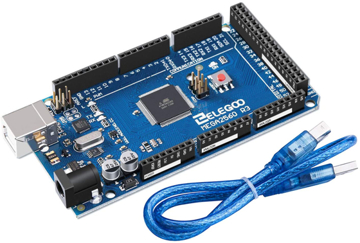

# Arduino Mega 2560 with Optiboot Flash
*Write permanent data in flash memory at run-time on Arduino Mega 2560.*

To ***write permanent data in flash memory at run-time*** on Arduino Mega 2560, we need to burn a particular bootloader: <a href="https://github.com/MCUdude/optiboot_flash" target="_blank">Optiboot Flash</a>.

## What is Optiboot Flash ?

<a href="https://github.com/Optiboot/optiboot/wiki" target="_blank">Optiboot</a> is an easy to install upgrade to the Arduino bootloader within Arduino boards. It provides the following features:

* Allows larger sketches. Optiboot is only 512 bytes, freeing 1.5k of extra code space compared to older bootloaders.
* Makes your sketches upload faster. Optiboot operates at higher baud rates and has streamlined programming.
* Adaboot performance improvements. Optiboot implements "fastboot" that starts sketches immediate after power-on.
* Compatible with ATmega8, ATmega168, and ATmega328p Arduinos and derivatives including Lilypad, Pro, Nano, and many derivatives.
* Works with MANY additional Atmel AVR chips - almost anything that supports bootloads or "flash self-programming." This includes chips from ATtiny 8pin chips through the 100pin ATmega2560 used on Arduino Mega.
* Supports alternate serial ports, CPU frequencies and baud rates.

There are some major repositories of "generic" versions of cores for various targets, including:
* <a href="https://github.com/MCUdude/MegaCore" target="_blank">MegaCore by MCUdude</a> which supports large AVRs like ATmega128, ATmega640, ATmega1280, ATmega1281, ATmega2560 and ATmega2561.

***<a href="https://github.com/MCUdude/optiboot_flash" target="_blank">Optiboot Flash</a>*** is part of MegaCore and provides key features:
* Small in size (<512B when EEPROM upload support is disabled)
* Supports baudrates upto 1Mbit
* ***Supports write to flash within application***
* Compatible with a most AVR microcontrollers
* EEPROM upload support

## Easy process to burn bootloader
We burn the `optiboot_flash` bootloader with an easy process using:
* Arduino IDE
* USB AVR programmer which emulates an STK500 on a virtual serial port
* MegaCore: an Arduino core for ATmega64, ATmega128, ATmega640, ATmega1280, ATmega1281, ATmega2560, ATmega2561, AT90CAN32, AT90CAN64 and AT90CAN128, all running Optiboot flash. 

## Required hardware and software
* <a href="https://store.arduino.cc/arduino-mega-2560-rev3" target="_blank">Arduino Mega 2560 Rev3</a> or <a href="https://www.amazon.fr/gp/product/B06XKZY117" target="_blank">Elegoo Mega 2560 R3</a>

* <a href="https://www.pololu.com/product/3172" target="_blank">Pololu USB AVR Programmer v2.1</a> or equivalent

* <a href="https://www.pololu.com/resources/software" target="_blank">Pololu USB AVR Programmer v2 Software and Drivers for Windows (.msi)</a> 

* <a href="https://www.arduino.cc/en/main/software" target="_blank">Arduino IDE for Windows</a> (release 1.8.13 at this time)

* <a href="https://github.com/MCUdude/MegaCore" target="_blank">MegaCore: an Arduino core for ATmega2560 running Optiboot flash</a>

In [./extras](./extras) folder youy will find software that We used the time I wrote this how-to:
* Pololu USB AVR Programmer Drivers 2.1.1.0 for Windows
* MegaCore source code in `MegaCore-master.zip` (get the <a href="https://github.com/MCUdude/MegaCore/archive/master.zip" target="_blank">latest</a>)

## Resources

* ........
* ........

## Author

**Jean-Michel _(Jim)_ FAURE** (July 9th, 2020)
* company: FAURE SYSTEMS®
* mail: *dev at faure dot systems*
* github: <a href="https://github.com/fauresystems" target="_blank">fauresystems</a>
* web: <a href="https://faure.systems/" target="_blank">Faure●Systems</a>