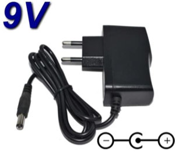
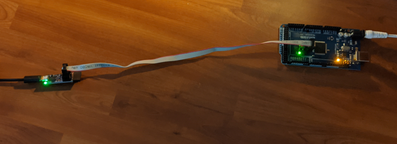
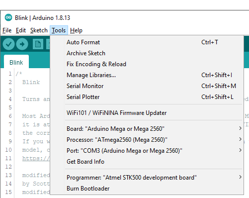

# Arduino Mega 2560 with Optiboot Flash
*Write permanent data in flash memory at run-time on Arduino Mega 2560.*

To ***write permanent data in flash memory at run-time*** on Arduino Mega 2560, we need to burn a particular bootloader: <a href="https://github.com/MCUdude/optiboot_flash" target="_blank">Optiboot Flash</a>.

## What is Optiboot Flash ?

<a href="https://github.com/Optiboot/optiboot/wiki" target="_blank">Optiboot</a> is an easy to install upgrade to the Arduino bootloader within Arduino boards. It provides the following features:

* Allows larger sketches. Optiboot is only 512 bytes, freeing 1.5k of extra code space compared to older bootloaders.
* Makes your sketches upload faster. Optiboot operates at higher baud rates and has streamlined programming.
* Adaboot performance improvements. Optiboot implements "fastboot" that starts sketches immediate after power-on.
* Compatible with ATmega8, ATmega168, and ATmega328p Arduinos and derivatives including Lilypad, Pro, Nano, and many derivatives.
* Works with MANY additional Atmel AVR chips - almost anything that supports bootloads or "flash self-programming." This includes chips from ATtiny 8pin chips through the 100pin ATmega2560 used on Arduino Mega.
* Supports alternate serial ports, CPU frequencies and baud rates.

There are some major repositories of "generic" versions of cores for various targets, including:
* <a href="https://github.com/MCUdude/MegaCore" target="_blank">MegaCore by MCUdude</a> which supports large AVRs like ATmega128, ATmega640, ATmega1280, ATmega1281, ATmega2560 and ATmega2561.

***<a href="https://github.com/MCUdude/optiboot_flash" target="_blank">Optiboot Flash</a>*** is part of MegaCore and provides key features:
* Small in size (<512B when EEPROM upload support is disabled)
* Supports baudrates upto 1Mbit
* ***Supports write to flash within application***
* Compatible with a most AVR microcontrollers
* EEPROM upload support


## Easy process to burn bootloader
We burn the `optiboot_flash` bootloader with an easy process using:
* Arduino IDE
* USB AVR programmer which emulates an STK500 on a virtual serial port
* MegaCore, an Arduino core for ATmega64, ATmega128, ATmega640, ATmega1280, ATmega1281, ATmega2560, ATmega2561, AT90CAN32, AT90CAN64 and AT90CAN128, all running Optiboot flash. 


## Required hardware and software
* <a href="https://store.arduino.cc/arduino-mega-2560-rev3" target="_blank">Arduino Mega 2560 Rev3</a> or <a href="https://www.amazon.fr/gp/product/B06XKZY117" target="_blank">Elegoo Mega 2560 R3</a>


* <a href="https://www.amazon.fr/TOP-CHARGEUR-Adaptateur-Alimentation-Microcontr%C3%B4leur/dp/B07HKD9215" target="_blank">9v adapter for Arduino</a>



* <a href="https://www.pololu.com/product/3172" target="_blank">Pololu USB AVR Programmer v2.1</a> or equivalent


* <a href="https://www.pololu.com/resources/software" target="_blank">Pololu USB AVR Programmer v2 Software and Drivers for Windows (.msi)</a> 

* <a href="https://www.arduino.cc/en/main/software" target="_blank">Arduino IDE for Windows</a> (release 1.8.13 at this time)

* <a href="https://github.com/MCUdude/MegaCore" target="_blank">MegaCore: an Arduino core for ATmega2560 running Optiboot flash</a>

In [./extras](./extras) folder you will find software that we used the time I wrote this how-to:
* Pololu USB AVR Programmer Drivers 2.1.1.0 for Windows
* MegaCore source code in `MegaCore-master.zip` (get the <a href="https://github.com/MCUdude/MegaCore/archive/master.zip" target="_blank">latest</a>)


## Connect Mega and AVR programmer with ISP cable
The correct connection:


## Test the AVR programmer
1. Connect you PC to the AVR programmer with an USB cable and power the Mega 2560 with a 9v adapter:



2. Open Arduino IDE and load `Examples/01.Basics/Blink` sketch

3. Upload sketch to Mega via AVR programmer:

    * Select `Tools/Programmer`: **"Atmel STK500 development board"**
    * Upload with `Sketch/Upload Using Programmer   ctrl-Shift-U`
      

4. **Check that the Mega on-board LED is blinking**: we are ready to continue


## Install MegaCore boards manager
We follow <a href="https://github.com/MCUdude/MegaCore#boards-manager-installation" target="_blank">instructions given by MCUdude in there</a>.

* Open the Arduino IDE.

* Open the **File > Preferences** menu item.

* Enter the following URL in **Additional Boards Manager URLs**: `https://mcudude.github.io/MegaCore/package_MCUdude_MegaCore_index.json`

* Open the **Tools > Board > Boards Manager...** menu item.

* Wait for the platform indexes to finish downloading.

* Scroll down until you see the **MegaCore** entry and click on it.

  

* Click **Install**.

* After installation is complete close the **Boards Manager** window.


## Burn optiboot_flash
We follow <a href="https://github.com/Optiboot/optiboot/wiki/InstallingOnChips#installing-using-the-arduino-ide" target="_blank">instructions given by MCUdude in there</a>.

1. Install the files as directed, usually (for Arduino 1.0+) in a subdirectory of your personal sketch's `../hardware/` directory:

    * Download MegaCore source code: MegaCore-master.zip from https://github.com/MCUdude/MegaCore

    * Extract the `optiboot_flash` folder from `MegaCore-master.zip` in: `C:\Program Files (x86)\Arduino\hardware\arduino\avr\bootloaders`

      


2. Connect a device programmer to the ISP connector of the target board, we've done that when we <a href="#test-the-avr-programmer" target="_blank">tested the AVR programmer</a>:
  

--> see pololu-mega-wiring.png

3. Running the Arduino IDE, select the tools/board of the target chip, and the tools/programmer of your programmer, and if necessary the tools/serial port of the programmer:

    * we need to select the `ATmega2560` as a **Megacore** board
      

    * `ATmega2560` board default settings works well
      

4.Select Tools/Burn Bootloader

```bash****
avrdude: Version 6.3-20190619
         Copyright (c) 2000-2005 Brian Dean, http://www.bdmicro.com/
         Copyright (c) 2007-2014 Joerg Wunsch

         System wide configuration file is "C:\Users\jm_de\AppData\Local\Arduino15\packages\MegaCore\hardware\avr\2.0.3/avrdude.conf"

         Using Port                    : COM5
         Using Programmer              : stk500
         AVR Part                      : ATmega2560
         Chip Erase delay              : 9000 us
         PAGEL                         : PD7
         BS2                           : PA0
         RESET disposition             : dedicated
         RETRY pulse                   : SCK
         serial program mode           : yes
         parallel program mode         : yes
         Timeout                       : 200
         StabDelay                     : 100
         CmdexeDelay                   : 25
         SyncLoops                     : 32
         ByteDelay                     : 0
         PollIndex                     : 3
         PollValue                     : 0x53
         Memory Detail                 :

                                  Block Poll               Page                       Polled
           Memory Type Mode Delay Size  Indx Paged  Size   Size #Pages MinW  MaxW   ReadBack
           ----------- ---- ----- ----- ---- ------ ------ ---- ------ ----- ----- ---------
           eeprom        65    10     8    0 no       4096    8      0  9000  9000 0x00 0x00
           flash         65    10   256    0 yes    262144  256   1024  4500  4500 0x00 0x00
           lfuse          0     0     0    0 no          1    0      0  9000  9000 0x00 0x00
           hfuse          0     0     0    0 no          1    0      0  9000  9000 0x00 0x00
           efuse          0     0     0    0 no          1    0      0  9000  9000 0x00 0x00
           lock           0     0     0    0 no          1    0      0  9000  9000 0x00 0x00
           calibration    0     0     0    0 no          1    0      0     0     0 0x00 0x00
           signature      0     0     0    0 no          3    0      0     0     0 0x00 0x00

         Programmer Type : STK500V2
         Description     : Atmel STK500
         Programmer Model: STK500
         Hardware Version: 15
         Firmware Version Master : 2.10
         Topcard         : Unknown
         Vtarget         : 5.1 V
         SCK period      : 8.7 us
         Varef           : 0.0 V
         Oscillator      : Off

avrdude: AVR device initialized and ready to accept instructions

Reading | ################################################## | 100% 0.00s

avrdude: Device signature = 0x1e9801 (probably m2560)
avrdude: erasing chip
avrdude: reading input file "0x3f"
avrdude: writing lock (1 bytes):

Writing | ################################################## | 100% 0.00s

avrdude: 1 bytes of lock written
avrdude: verifying lock memory against 0x3f:
avrdude: load data lock data from input file 0x3f:
avrdude: input file 0x3f contains 1 bytes
avrdude: reading on-chip lock data:

Reading | ################################################## | 100% 0.00s

avrdude: verifying ...
avrdude: 1 bytes of lock verified
avrdude: reading input file "0xfd"
avrdude: writing efuse (1 bytes):

Writing | ################################################## | 100% 0.00s

avrdude: 1 bytes of efuse written
avrdude: verifying efuse memory against 0xfd:
avrdude: load data efuse data from input file 0xfd:
avrdude: input file 0xfd contains 1 bytes
avrdude: reading on-chip efuse data:

Reading | ################################################## | 100% 0.00s

avrdude: verifying ...
avrdude: 1 bytes of efuse verified
avrdude: reading input file "0xd6"
avrdude: writing hfuse (1 bytes):

Writing | ################################################## | 100% 0.01s

avrdude: 1 bytes of hfuse written
avrdude: verifying hfuse memory against 0xd6:
avrdude: load data hfuse data from input file 0xd6:
avrdude: input file 0xd6 contains 1 bytes
avrdude: reading on-chip hfuse data:

Reading | ################################################## | 100% 0.00s

avrdude: verifying ...
avrdude: 1 bytes of hfuse verified
avrdude: reading input file "0xf7"
avrdude: writing lfuse (1 bytes):

Writing | ################################################## | 100% 0.01s

avrdude: 1 bytes of lfuse written
avrdude: verifying lfuse memory against 0xf7:
avrdude: load data lfuse data from input file 0xf7:
avrdude: input file 0xf7 contains 1 bytes
avrdude: reading on-chip lfuse data:

Reading | ################################################## | 100% 0.00s

avrdude: verifying ...
avrdude: 1 bytes of lfuse verified

avrdude done.  Thank you.
```

--> see ok_after_uploading_bootloader.mp4 video (just after uploading: double fast flash if upload was OK)


## Test read/write flash memory at run-time

.........


## Resources

* [./extras](./extras) 
* <a href="https://github.com/MCUdude/optiboot_flash" target="_blank">MCUdude / optiboot_flash</a>
* <a href="https://github.com/MCUdude/MegaCore" target="_blank">MCUdude / MegaCore</a>
* <a href="https://github.com/Optiboot/optiboot/wiki" target="_blank">optiboot wiki</a>
* <a href="https://www.pololu.com/product/3172" target="_blank">Pololu USB AVR Programmer v2.1</a>
* <a href="https://www.pololu.com/resources/software" target="_blank">Pololu software</a>
* <a href="https://www.elegoo.com/product/elegoo-mega-2560-r3-board-blue-atmega2560-atmega16u2-usb-cable/" target="_blank">ELEGOO MEGA 2560 R3 Board Blue</a>

## Author

**Jean-Michel _(Jim)_ FAURE** (July 9th, 2020)
* company: FAURE SYSTEMS®
* mail: *dev at faure dot systems*
* github: <a href="https://github.com/fauresystems" target="_blank">fauresystems</a>
* web: <a href="https://faure.systems/" target="_blank">Faure●Systems</a>